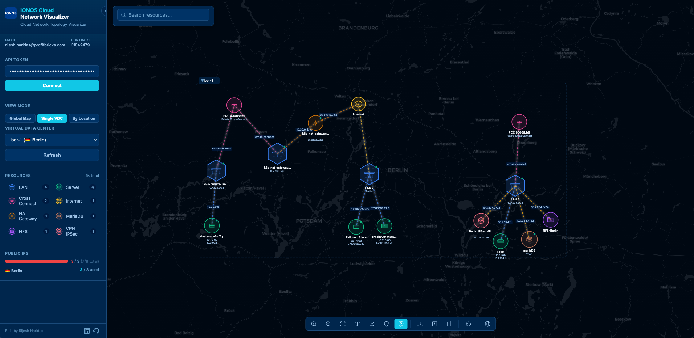

<p align="center">
  
</p>

<p align="center">
  <a href="LICENSE"></a>
  
  
  
  
  
</p>

<p align="center">
  A browser-based interactive network topology visualizer for IONOS Cloud infrastructure.<br>
  See your entire cloud at a glance — from a global map of regions down to individual NICs and firewall rules.
</p>

## Key Capabilities

**See every managed service connected to your LANs** — Databases (PostgreSQL, MongoDB, MySQL, MariaDB), VPN Gateways, NFS shares, Load Balancers, Kubernetes clusters, and Kafka clusters are all rendered on the topology graph, connected to the LANs they belong to. No more jumping between DCD panels to understand which services share a network.

**Global Map View** — After connecting, an interactive geographic map shows all your IONOS regions with cluster bubbles sized by VDC count. Click a region to drill down into individual VDCs, then click a VDC to visualize its topology. A natural way to navigate multi-region infrastructure.

**Regional view with cross-connect visibility** — The "By Location" mode loads all VDCs within a region (e.g., Frankfurt) onto a single canvas, making Private Cross Connect links between data centers immediately visible. VDCs in the same metro (fra/1, fra/2) are treated as one region since they can be interconnected.

**IP View** — Toggle IP address labels across the entire topology and inspect public IP block allocations (IPv4 and IPv6) in a dedicated sidebar panel. Quickly audit which IPs are assigned where.

**Highlights overlay** — Filter the topology by security attributes: Firewall Active, Flow Logs, Security Groups, IPv6 Enabled, IP Failover, and Cross Connect. Matching nodes glow with concentric highlight rings while everything else fades, making compliance audits visual and fast.

**Metrics at a glance** — Select a server to see 1-hour network throughput and packet count time-series charts directly in the detail panel. No need to leave the visualizer to check basic performance data.

## Screenshot



## Quick Start

```bash
git clone https://github.com/rijeshharidas/ionos-cloud-network-visualizer.git
cd ionos-cloud-network-visualizer
python3 serve.py
```

The server automatically opens your browser at `http://localhost:8080` (with automatic fallback to the next available port if 8080 is in use).

**No npm, no build step, no pip install required** — just Python and a browser.

1. Enter your IONOS Cloud API token
2. The Global Map loads automatically — explore your regions
3. Click into any VDC to visualize its full network topology

<details>
<summary><strong>Installing Python</strong> (click to expand — skip if you already have Python 3.6+)</summary>

### macOS

Python 3 comes pre-installed on recent macOS versions. Open **Terminal** (search "Terminal" in Spotlight) and check:

```bash
python3 --version
```

If the command is not found, install Python using one of these methods:

**Option A — Official installer (recommended for non-developers):**
Download from <https://www.python.org/downloads/> and run the `.pkg` installer.

**Option B — Homebrew:**

```bash
brew install python
```

### Windows

**Option A — Official installer (recommended):**

1. Go to <https://www.python.org/downloads/>
2. Click **"Download Python 3.x.x"**
3. Run the installer — **check "Add python.exe to PATH"** at the bottom of the first screen
4. Click "Install Now"
5. Open **Command Prompt** or **PowerShell** and verify:

```cmd
python --version
```

> **Note:** On Windows, use `python` instead of `python3`:
>
> ```cmd
> python serve.py
> ```

**Option B — Microsoft Store:**
Search "Python" in the Microsoft Store and install the latest version.

### Linux (Ubuntu / Debian)

Python 3 is usually pre-installed. Check with:

```bash
python3 --version
```

If missing:

```bash
sudo apt update && sudo apt install python3
```

### Verifying Your Installation

After installation, confirm Python is available:

```bash
python3 --version   # macOS / Linux
python --version    # Windows
```

You should see `Python 3.x.x`. Any version from 3.6 onward works.

</details>

## Prerequisites

- **Python 3.6+** — standard library only, no pip dependencies needed
- **Modern browser** — Chrome, Firefox, Safari, or Edge
- **IONOS Cloud API Token** — generate at <https://dcd.ionos.com> under **Management > Token Management**

## View Modes

The visualizer offers three complementary perspectives on your infrastructure:

**Global Map** — An interactive Leaflet.js map centered on Europe and North America showing IONOS regions as cluster bubbles with country flags and VDC counts. Click a region to zoom in and see individual VDC markers, then click a VDC to load its topology. Press `G` to return to this view at any time.

**Single VDC** — The classic topology view. Select a data center from the dropdown to render its full force-directed network graph: servers, LANs, NICs, managed services, gateways, and load balancers, all connected and laid out hierarchically.

**By Location** — Select a region (e.g., Frankfurt) to load every VDC in that metro onto one canvas. This is the only way to see Private Cross Connect links between data centers, since those connections span VDC boundaries.

## Supported Resource Types

Each resource type has a distinctive custom SVG icon for instant visual identification:

| Category | Resources |
|----------|-----------|
| Compute | Servers, Cube Servers, Kubernetes Node Pools |
| Networking | LANs, NICs, NAT Gateways, Private Cross Connects |
| Databases | PostgreSQL, MongoDB, MySQL, MariaDB |
| Storage | Network File System (NFS) |
| Security | VPN Gateways (WireGuard, IPSec) |
| Load Balancing | Application Load Balancers, Network Load Balancers |
| Streaming | Kafka Clusters |

## Features

**Topology Visualization** — Force-directed graph with hierarchical layout (Cross Connect → Internet → LANs → VMs and managed services). Connected-component clustering keeps unrelated network groups separated. Color-coded link types distinguish NIC, cross connect, managed service, gateway, and internet connections.

**Geographic Map Background** — A Leaflet.js map (CartoDB Dark Matter tiles) renders behind the topology graph, providing geographic context for the region you're viewing. Toggle with `M`.

**Interactive Detail Panel** — Click any node to inspect its full properties: IPs, MAC addresses, hardware specs, status, security groups, firewall rules, connected resources, and live metrics charts.

**Canvas Search** — Floating search bar with type-ahead filtering across all resources. Results highlight matching nodes on the canvas. Focus with `Ctrl+F`.

**Export** — Download the topology as PNG, SVG, or JSON for documentation and sharing.

**Animated Traffic Flow** — Links between active resources show animated directional flow with a glowing effect.

**Node Status Indicators** — Color-coded badges showing resource state (AVAILABLE, RUNNING, BUSY, INACTIVE, ERROR) at a glance.

**Collapsible Sidebar** — Expand or collapse to maximize canvas space, with a persistent re-expand button.

## Architecture

Two files, zero build process:

**`ionos-cloud-network-visualizer.html`** — Self-contained frontend with D3.js v7 for topology, Leaflet.js v1.9.4 for maps, and all CSS/JS inline. No external build tools or bundlers.

**`serve.py`** — Lightweight localhost CORS proxy (Python standard library only) that bridges browser requests to IONOS Cloud APIs. Your API token never leaves your machine.

```text
Browser (localhost:8080) → Proxy (localhost:8080) → IONOS API (*.ionos.com)
```

## Supported IONOS Cloud Services

| Service | API Endpoint | Scope |
|---------|--------------|-------|
| Virtual Servers | `/cloudapi/v6` | Per Data Center |
| Networks (LANs) | `/cloudapi/v6` | Per Data Center |
| Network Interfaces | `/cloudapi/v6` | Per Data Center |
| PostgreSQL | `/databases/postgresql` | Centralized |
| MongoDB | `/databases/mongodb` | Centralized |
| MySQL | `/databases/mysql` | Centralized |
| MariaDB | `mariadb.{location}.ionos.com` | Regional |
| VPN Gateway | `vpn.{location}.ionos.com` | Regional |
| Network File System | `nfs.{location}.ionos.com` | Regional |
| Kubernetes | `/cloudapi/v6` | Centralized |
| NAT Gateway | `/cloudapi/v6` | Per Data Center |
| Load Balancers | `/cloudapi/v6` | Per Data Center |
| Cross Connects | `/cloudapi/v6` | Centralized |
| Kafka | `kafka.{location}.ionos.com` | Regional |
| User Management | `/cloudapi/v6/um` | Centralized |

## Configuration

```bash
python3 serve.py [options]
```

| Option | Default | Description |
|--------|---------|-------------|
| `--port PORT` | `8080` | Server port (auto-increments if unavailable) |
| `--no-browser` | `false` | Don't auto-open the browser |

## Keyboard Shortcuts

| Key | Action |
|-----|--------|
| `?` or `/` | Show keyboard shortcuts help |
| `Escape` | Close panels and overlays |
| `Ctrl/Cmd+F` | Focus search bar |
| `+` / `-` | Zoom in / out |
| `F` | Fit graph to view |
| `L` | Toggle labels |
| `I` | Toggle IP view |
| `H` | Toggle highlights overlay |
| `M` | Toggle map background |
| `G` | Global map view |
| `R` | Reset view |

## Security

- **Token Isolation** — Your API token never leaves your local machine. The proxy validates that all forwarded requests target only `*.ionos.com` domains.
- **In-Memory Storage** — Tokens are stored exclusively in browser memory and cleared when you close the tab. No persistence to disk or cookies.
- **Localhost Binding** — The proxy binds to `127.0.0.1` only, preventing remote access.
- **XSS Protection** — All user-controlled content is escaped before rendering in the DOM.

## Contributing

We welcome contributions! Please refer to [CONTRIBUTING.md](CONTRIBUTING.md) for guidelines on submitting issues, proposing features, and making pull requests.

## License

IONOS Cloud Network Visualizer is licensed under the [Apache License 2.0](LICENSE).

## Links

- **IONOS Cloud Platform** — <https://cloud.ionos.com>
- **IONOS Cloud API Documentation** — <https://api.ionos.com/docs/cloud/v6/>
- **GitHub Issues** — <https://github.com/rijeshharidas/ionos-cloud-network-visualizer/issues>
- **IONOS Cloud Status** — <https://status.ionos.com>

---

**IONOS Cloud** — Enterprise cloud infrastructure made simple.
